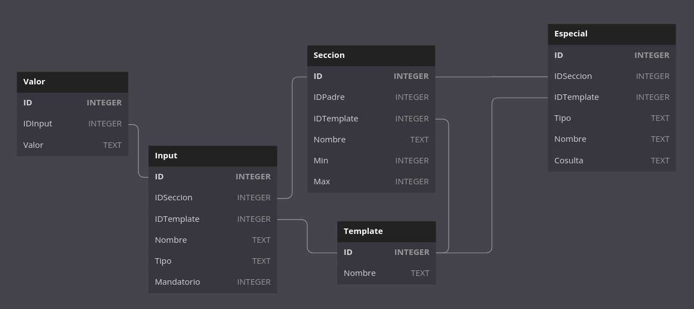

## Generador de formularios aplicativo movil

Las tecnologias utilizadas son:

- nodejs
- express
- sqlite
- sequelize

## Modelo

Este es el modelo de las tablas necesarias para el funcionamiento de los formularios del aplicativo movil.

